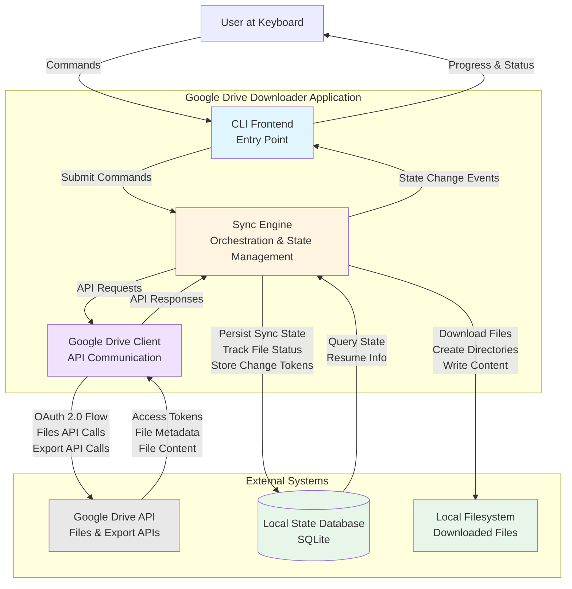

# Google Drive Downloader — Technical Design Document

**Project:** Google Drive Incremental Backup Utility
**Language:** Kotlin (JVM) with GraalVM Native Image
**Target Platform:** Ubuntu Linux (native binary)
**Version:** 1.0 Draft

---

## 1. Executive Summary

Google Drive Downloader is a command-line utility that incrementally downloads all files from a user's Google Drive to their local filesystem. The program compiles to a native Linux binary with no JVM runtime dependency, supports resumable operations, and only downloads files that have changed since the last synchronization.

---

## 2. Requirements

### 2.1 Functional Requirements

| ID   | Requirement                                                              |
|------|--------------------------------------------------------------------------|
| FR-1 | Download all files from a user's Google Drive to a local directory       |
| FR-2 | Support incremental sync — only download new or modified files           |
| FR-3 | Resume interrupted downloads without re-downloading completed files      |
| FR-4 | Preserve Google Drive folder hierarchy locally                           |
| FR-5 | Export Google Workspace files (Docs, Sheets, Slides) to standard formats |
| FR-6 | Authenticate using OAuth 2.0 via the Google Drive API                    |

### 2.2 Non-Functional Requirements

| ID    | Requirement                                                                     |
|-------|---------------------------------------------------------------------------------|
| NFR-1 | Compile to native binary using GraalVM Native Image (no JVM runtime dependency) |
| NFR-2 | Run on Ubuntu Linux (x86_64)                                                    |
| NFR-3 | Handle large Drive accounts (100,000+ files)                                    |
| NFR-4 | Provide progress feedback during sync operations                                |
| NFR-5 | Log operations for debugging and audit purposes                                 |

---

## 3. Architecture Overview

### 3.1 High-Level Architecture



### 3.2 Component Descriptions

**Google Drive Client**: Handles communication with Google Drive APIs, including Oauth 2.0 authorization flow, and usage of the Files and Export APIs.

**Sync Engine**: Orchestrates file download with support for concurrent transfers, retry logic, and partial download resumption. Persists sync state to enable incremental updates and crash recovery. Manages the local state database. Provides a mechanism for higher layers to subscribe to state changes, to allow progress reporting in a user-facing UI.

**CLI Frontend**: Entry point. Submits commands to the sync engine and subscribes to state changes from the Sync Engine to report progress to the user at the keyboard.

---

## 4. Google Drive Client

**Responsibilities:** OAuth authentication, Google Drive API communication, rate limiting, retry logic with exponential backoff.

### 4.1 Interface Specification

```kotlin
package dev.dking.gdrivesync.api

import java.nio.file.Path
import java.time.Instant

/**
 * Client for interacting with the Google Drive API.
 * Handles OAuth 2.0 authentication, file listing, change detection, and file downloads.
 */
interface GoogleDriveClient {
    /**
     * Authenticate with Google Drive using OAuth 2.0 with PKCE.
     * @param forceReauth Force re-authentication even if valid tokens exist
     * @return Result indicating success or authentication failure
     */
    suspend fun authenticate(forceReauth: Boolean = false): Result<Unit>

    /**
     * Check if currently authenticated with valid, non-expired tokens.
     * @return true if authenticated and tokens are valid
     */
    fun isAuthenticated(): Boolean

    /**
     * Get the initial page token for change detection.
     * @return Result containing the start page token or error
     */
    suspend fun getStartPageToken(): Result<String>

    /**
     * List all files and folders in Google Drive.
     * Handles pagination internally and returns complete list.
     * @param fields Set of fields to retrieve for each file
     * @return Result containing list of all DriveFile objects or error
     */
    suspend fun listAllFiles(fields: Set<FileField>): Result<List<DriveFile>>

    /**
     * List changes since a given page token.
     * @param pageToken The page token from which to start listing changes
     * @return Result containing ChangeList with changes and new token, or error
     */
    suspend fun listChanges(pageToken: String): Result<ChangeList>

    /**
     * Download a regular (non-Workspace) file to the specified path.
     * @param fileId Google Drive file ID
     * @param outputPath Local path where file should be saved
     * @param onProgress Optional callback for download progress updates
     * @return Result indicating success or download failure
     */
    suspend fun downloadFile(
        fileId: String,
        outputPath: Path,
        onProgress: (bytesDownloaded: Long, totalBytes: Long?) -> Unit = { _, _ -> }
    ): Result<Unit>

    /**
     * Export a Google Workspace file to a standard format.
     * @param fileId Google Drive file ID
     * @param exportMimeType Target MIME type for export (e.g., DOCX, XLSX)
     * @param outputPath Local path where exported file should be saved
     * @return Result indicating success or export failure
     */
    suspend fun exportFile(
        fileId: String,
        exportMimeType: String,
        outputPath: Path
    ): Result<Unit>
}

/**
 * Represents a file or folder in Google Drive.
 */
data class DriveFile(
    val id: String,
    val name: String,
    val mimeType: String,
    val parentId: String?,
    val md5Checksum: String?,
    val modifiedTime: Instant,
    val size: Long?,
    val isFolder: Boolean,
    val shortcutTargetId: String? = null
)

/**
 * Represents a list of changes from the Google Drive API.
 */
data class ChangeList(
    val changes: List<FileChange>,
    val newStartPageToken: String
)

/**
 * Represents a single change (add/modify/remove) to a file.
 */
data class FileChange(
    val fileId: String,
    val removed: Boolean,
    val file: DriveFile?
)

/**
 * Fields that can be requested when listing files.
 */
enum class FileField {
    ID, NAME, MIME_TYPE, PARENTS, MD5_CHECKSUM, MODIFIED_TIME, SIZE, SHORTCUT_DETAILS
}

/**
 * Configuration for the Google Drive Client.
 */
data class DriveClientConfig(
    val retryAttempts: Int = 3,
    val retryDelaySeconds: Int = 5
)
```

### 4.2 Required API Endpoints

The Google Drive Client interacts with the following Google Drive API v3 endpoints:

| Endpoint                                 | Purpose                              |
|------------------------------------------|--------------------------------------|
| `GET /drive/v3/files`                    | List files and folders with metadata |
| `GET /drive/v3/files/{fileId}`           | Get specific file metadata           |
| `GET /drive/v3/files/{fileId}?alt=media` | Download file content                |
| `GET /drive/v3/files/{fileId}/export`    | Export Google Workspace files        |
| `GET /drive/v3/changes/startPageToken`   | Get initial change token             |
| `GET /drive/v3/changes`                  | List changes since last sync         |

### 4.3 OAuth 2.0 Authentication

**Scopes Required:**
- `https://www.googleapis.com/auth/drive.readonly` — Read-only access to all files

**Authorization Flow (PKCE):**

The application uses OAuth 2.0 with PKCE (Proof Key for Code Exchange) for secure authentication:

1. Application generates PKCE code verifier and challenge
2. User is directed to Google's authorization URL in their browser
3. Application starts local HTTP server on `localhost:8085` to receive callback
4. User grants permission, Google redirects with authorization code
5. Application exchanges code for access and refresh tokens
6. Tokens are stored locally with restricted file permissions

**Token Storage:**

**Location:** `~/.google-drive-downloader/tokens.json` (file permissions: 600)

```json
{
  "access_token": "ya29.a0AfH6SM...",
  "refresh_token": "1//0eXx...",
  "token_type": "Bearer",
  "expires_at": "2025-05-15T14:30:00Z",
  "scope": "https://www.googleapis.com/auth/drive.readonly"
}
```

The refresh token enables long-term access and must be protected. File permissions are set to 600 to prevent unauthorized access.

### 4.4 Rate Limiting and Quotas

Google Drive API has the following default quotas:

| Quota                            | Limit         |
|----------------------------------|---------------|
| Queries per day                  | 1,000,000,000 |
| Queries per 100 seconds per user | 1,000         |
| Queries per 100 seconds          | 10,000        |

The application implements exponential backoff when receiving `429 Too Many Requests` or `503 Service Unavailable` responses.

### 4.5 Error Handling and Retry Logic

Network timeouts, rate limits, and temporary server errors are handled with exponential backoff. The client wraps fallible operations in `Result<T>` types rather than throwing exceptions.

**Retry Strategy:**

```
PROCEDURE RetryWithBackoff(operation, max_attempts=3):
    delay = 1 second
    FOR attempt IN 1..max_attempts:
        result = operation()
        IF result.isSuccess:
            RETURN result
        ELSE IF result.isTransientError:  // 429, 503, network timeout
            IF attempt == max_attempts:
                RETURN result  // Return the failure as Result.failure
            Sleep(delay + random_jitter)
            delay = delay * 2
        ELSE:  // Permanent error (401, 404, etc.)
            RETURN result  // No retry for permanent errors
```

**Implementation Notes:**

- Use Kotlin's `Result<T>` type for all operations that can fail
- Transient errors (429, 503, timeouts) trigger retry with exponential backoff
- Permanent errors (401 Unauthorized, 404 Not Found) return immediately without retry
- Random jitter (±25%) is added to delay to avoid thundering herd
- All retry logic is internal to the client implementation, not exposed in the interface
- Pagination is handled internally by `listAllFiles()` to simplify caller code

---

## 5. Sync Engine

**Responsibilities:** Orchestrate file downloads, manage local state database, coordinate file operations, publish progress events via Kotlin Flow.

### 5.1 Interface Specification

```kotlin
package dev.dking.gdrivesync.sync

import kotlinx.coroutines.flow.Flow
import java.nio.file.Path
import java.time.Duration
import java.time.Instant

/**
 * Core sync engine that orchestrates downloading files from Google Drive.
 * Emits progress events via Flow and manages local state persistence.
 */
interface SyncEngine {
    /**
     * Perform full initial sync, downloading all files from Google Drive.
     * Emits SyncEvent updates throughout the process.
     * @return Flow of sync events from start to completion or failure
     */
    fun initialSync(): Flow<SyncEvent>

    /**
     * Perform incremental sync based on detected changes since last sync.
     * Uses change tokens to efficiently detect modified/new/deleted files.
     * @return Flow of sync events from start to completion or failure
     */
    fun incrementalSync(): Flow<SyncEvent>

    /**
     * Resume an interrupted sync if one exists, otherwise perform incremental sync.
     * Checks database for incomplete sync run and continues from where it left off.
     * @return Flow of sync events from resume/start to completion or failure
     */
    fun resumeSync(): Flow<SyncEvent>

    /**
     * Get current sync status snapshot without performing a sync.
     * @return Result containing current SyncStatus or error
     */
    suspend fun getSyncStatus(): Result<SyncStatus>

    /**
     * Get list of files that failed to sync in the last run.
     * @return Result containing list of FileRecord with sync_status=ERROR or error
     */
    suspend fun getFailedFiles(): Result<List<FileRecord>>
}

/**
 * Events emitted during sync operations.
 */
sealed class SyncEvent {
    data class Started(val syncRunId: Long, val timestamp: Instant) : SyncEvent()
    data class DiscoveringFiles(val filesFound: Int) : SyncEvent()
    data class FileQueued(val fileId: String, val name: String, val size: Long?) : SyncEvent()
    data class FileDownloading(
        val fileId: String,
        val name: String,
        val bytesDownloaded: Long,
        val totalBytes: Long?
    ) : SyncEvent()
    data class FileCompleted(val fileId: String, val name: String) : SyncEvent()
    data class FileFailed(val fileId: String, val name: String, val error: String) : SyncEvent()
    data class Progress(
        val filesProcessed: Int,
        val totalFiles: Int,
        val bytesDownloaded: Long
    ) : SyncEvent()
    data class Completed(
        val filesProcessed: Int,
        val bytesDownloaded: Long,
        val failedFiles: Int,
        val duration: Duration
    ) : SyncEvent()
    data class Failed(val error: String) : SyncEvent()
}

/**
 * Current sync status snapshot.
 */
data class SyncStatus(
    val lastSyncTime: Instant?,
    val filesTracked: Int,
    val totalSize: Long,
    val pendingFiles: Int,
    val failedFiles: Int
)

/**
 * Represents a file record in the local state database.
 */
data class FileRecord(
    val id: String,
    val name: String,
    val mimeType: String,
    val parentId: String?,
    val localPath: String?,
    val remoteMd5: String?,
    val modifiedTime: Instant,
    val size: Long?,
    val isFolder: Boolean,
    val syncStatus: SyncStatus,
    val lastSynced: Instant?,
    val errorMessage: String?
) {
    enum class SyncStatus {
        PENDING, DOWNLOADING, COMPLETE, ERROR
    }
}

/**
 * Configuration for the Sync Engine.
 */
data class SyncEngineConfig(
    val downloadDirectory: Path,
    val exportFormats: Map<String, String>,
    val maxConcurrentDownloads: Int = 4,
    val deleteRemovedFiles: Boolean = false
)
```

### 5.2 Local State Database

The application maintains a SQLite database to track sync state. SQLite is chosen for its single-file simplicity, ACID compliance, and native compatibility through sqlite-jdbc with automatic GraalVM JNI configuration.

**Location:** `~/.google-drive-downloader/state.db`

#### Schema

```sql
-- Tracks the last known state of each file
CREATE TABLE files (
    id              TEXT PRIMARY KEY,    -- Google Drive file ID
    name            TEXT NOT NULL,
    mime_type       TEXT NOT NULL,
    parent_id       TEXT,                -- Parent folder ID (null for root)
    local_path      TEXT,                -- Relative path from sync root
    remote_md5      TEXT,                -- MD5 checksum from Drive
    modified_time   TEXT NOT NULL,       -- ISO 8601 timestamp
    size            INTEGER,             -- File size in bytes
    is_folder       INTEGER NOT NULL,    -- Boolean: 1 = folder, 0 = file
    sync_status     TEXT NOT NULL,       -- pending, downloading, complete, error
    last_synced     TEXT,                -- ISO 8601 timestamp of last sync
    error_message   TEXT                 -- Last error if sync_status = error
);

-- Tracks overall sync operations
CREATE TABLE sync_runs (
    id              INTEGER PRIMARY KEY AUTOINCREMENT,
    started_at      TEXT NOT NULL,
    completed_at    TEXT,
    status          TEXT NOT NULL,       -- running, completed, failed, interrupted
    files_processed INTEGER DEFAULT 0,
    bytes_downloaded INTEGER DEFAULT 0,
    start_page_token TEXT,               -- For resuming change detection
    error_message   TEXT
);

-- Stores the page token for incremental change detection
CREATE TABLE change_tokens (
    id              INTEGER PRIMARY KEY CHECK (id = 1),
    page_token      TEXT NOT NULL,
    updated_at      TEXT NOT NULL
);

-- Index for efficient parent lookups during tree traversal
CREATE INDEX idx_files_parent ON files(parent_id);
CREATE INDEX idx_files_status ON files(sync_status);
```

### 5.3 Sync Algorithms

#### 5.3.1 Initial Sync (Full Download)

```
PROCEDURE InitialSync():
    page_token = GetStartPageToken()

    // Phase 1: Build file tree
    files = []
    next_page = null
    REPEAT:
        response = ListFiles(page_token=next_page,
                            fields="id,name,mimeType,parents,md5Checksum,modifiedTime,size")
        files.append(response.files)
        next_page = response.nextPageToken
    UNTIL next_page IS NULL

    // Phase 2: Insert into database
    FOR file IN files:
        INSERT INTO files (id, name, ..., sync_status='pending')

    // Phase 3: Download files (breadth-first to create folders first)
    queue = GetRootFolders()
    WHILE queue NOT EMPTY:
        item = queue.dequeue()
        IF item.is_folder:
            CreateLocalDirectory(item.local_path)
            MarkComplete(item.id)
            queue.enqueue(GetChildren(item.id))
        ELSE:
            DownloadFile(item)
            MarkComplete(item.id)

    // Phase 4: Store change token for incremental sync
    SaveChangeToken(page_token)
```

#### 5.3.2 Incremental Sync

```
PROCEDURE IncrementalSync():
    saved_token = GetSavedChangeToken()

    // Get all changes since last sync
    changes = []
    next_page = saved_token
    REPEAT:
        response = ListChanges(page_token=next_page)
        changes.append(response.changes)
        next_page = response.nextPageToken
        new_start_token = response.newStartPageToken
    UNTIL next_page IS NULL

    // Process changes
    FOR change IN changes:
        IF change.removed OR change.file.trashed:
            MarkForDeletion(change.fileId)
        ELSE IF IsNewFile(change.fileId):
            InsertFile(change.file, sync_status='pending')
        ELSE IF IsModified(change.file):
            UpdateFile(change.file, sync_status='pending')

    // Download pending files
    DownloadPendingFiles()

    // Optionally delete local files marked for deletion
    IF config.delete_removed_files:
        DeleteMarkedFiles()

    // Update change token
    SaveChangeToken(new_start_token)
```

#### 5.3.3 Resume After Interruption

```
PROCEDURE ResumeSync():
    // Check for incomplete sync run
    last_run = GetLastSyncRun()

    IF last_run.status == 'running' OR last_run.status == 'interrupted':
        // Resume from where we left off
        pending_files = SELECT * FROM files WHERE sync_status IN ('pending', 'downloading')

        FOR file IN pending_files:
            IF file.sync_status == 'downloading':
                // Check for partial download
                partial_path = GetPartialPath(file)
                IF EXISTS(partial_path):
                    ResumeDownload(file, partial_path)
                ELSE:
                    DownloadFile(file)
            ELSE:
                DownloadFile(file)

        MarkSyncComplete(last_run.id)
    ELSE:
        // Start new incremental sync
        IncrementalSync()
```

### 5.4 File Handling

#### 5.4.1 Regular Files

Regular files (non-Google Workspace) are downloaded directly using the `alt=media` parameter. The download process:

1. Create parent directories if they don't exist
2. Begin download to a temporary file (`filename.tmp`)
3. Verify MD5 checksum matches remote
4. Atomic rename to final filename
5. Update database record

#### 5.4.2 Google Workspace Files

Google Workspace files (Docs, Sheets, Slides, etc.) cannot be downloaded directly. They must be exported to a standard format:

| Google MIME Type                           | Export Format    | Extension |
|--------------------------------------------|------------------|-----------|
| `application/vnd.google-apps.document`     | DOCX             | `.docx`   |
| `application/vnd.google-apps.spreadsheet`  | XLSX             | `.xlsx`   |
| `application/vnd.google-apps.presentation` | PPTX             | `.pptx`   |
| `application/vnd.google-apps.drawing`      | PNG              | `.png`    |
| `application/vnd.google-apps.form`         | (not exportable) | —         |
| `application/vnd.google-apps.site`         | (not exportable) | —         |

The export format mapping is configured in `SyncEngineConfig.exportFormats`.

#### 5.4.3 Shortcuts and Links

Google Drive shortcuts are handled by:
1. Detecting `application/vnd.google-apps.shortcut` MIME type
2. Resolving the target file ID from `shortcutDetails.targetId`
3. Creating a local symlink pointing to the target file's local path

#### 5.4.4 Filename Sanitization

Google Drive allows characters that are invalid on Linux filesystems. The application sanitizes filenames:

- Replace `/` with `_`
- Replace null bytes with `_`
- Truncate names exceeding 255 bytes (UTF-8)
- Handle duplicate names by appending ` (1)`, ` (2)`, etc.

### 5.5 Error Handling and Recovery

#### 5.5.1 Permanent Errors

Files that fail after all retry attempts are marked with `sync_status='error'` and the error message is recorded in the database. The sync continues with remaining files. A summary of failed files is displayed at completion and can be retrieved via `getFailedFiles()`.

#### 5.5.2 Crash Recovery

The application is designed for crash recovery through:

1. **Atomic file writes:** Downloads go to `.tmp` files, then atomically renamed
2. **Database transactions:** State updates are wrapped in transactions
3. **Idempotent operations:** Re-running produces the same result
4. **Progress checkpointing:** Sync run progress is persisted regularly

### 5.6 Implementation Notes

**Flow-based Progress Reporting:**
- Each sync method returns `Flow<SyncEvent>` for reactive progress streaming
- CLI Frontend collects events to display real-time progress
- Events are emitted at key points: file queued, downloading, completed, failed
- Final event is always either `SyncEvent.Completed` or `SyncEvent.Failed`

**Breadth-First Traversal:**
- Initial sync uses breadth-first queue to create parent folders before downloading child files
- Ensures local filesystem hierarchy matches Google Drive structure
- Prevents errors from missing parent directories

**Concurrent Downloads:**
- `SyncEngineConfig.maxConcurrentDownloads` controls parallelism (default: 4)
- Uses coroutines with semaphore to limit concurrent operations
- Each download runs in its own coroutine with progress callbacks

**Database Transactions:**
- File status updates use transactions to ensure consistency
- Sync run creation and completion are atomic operations
- Change token updates are transactional with sync completion

**State Machine:**
- Files progress through states: PENDING → DOWNLOADING → COMPLETE (or ERROR)
- Database queries filter by `sync_status` to find work
- Resume logic queries for PENDING and DOWNLOADING files

---

## 6. CLI Frontend

**Responsibilities:** Command-line parsing using Picocli, user interaction, progress display, configuration loading and injection.

### 6.1 Command Structure

```kotlin
package dev.dking.gdrivesync.cli

import kotlinx.coroutines.flow.collect
import java.nio.file.Path
import kotlin.system.exitProcess

/**
 * Main entry point for the CLI application.
 */
object CliApplication {
    suspend fun main(args: Array<String>): Int {
        // Parse commands using Picocli
        // Load configuration
        // Create and inject dependencies (DriveClient, SyncEngine)
        // Execute command
        // Return exit code
    }
}

/**
 * Command definitions for Picocli.
 */
sealed class Command {
    /**
     * Authenticate with Google Drive using OAuth 2.0.
     */
    data class Auth(val force: Boolean = false) : Command()

    /**
     * Synchronize files from Google Drive.
     */
    data class Sync(
        val full: Boolean = false,
        val dryRun: Boolean = false,
        val includePattern: String? = null,
        val excludePattern: String? = null,
        val maxSize: Long? = null
    ) : Command()

    /**
     * Show current sync status and statistics.
     */
    object Status : Command()

    /**
     * Clear local state and start fresh.
     */
    object Reset : Command()
}

/**
 * Progress reporter for displaying sync events to the user.
 */
class ProgressReporter {
    /**
     * Report a single sync event to the user.
     * Handles formatting and display logic for each event type.
     */
    fun report(event: SyncEvent) {
        when (event) {
            is SyncEvent.Started -> println("Sync started at ${event.timestamp}")
            is SyncEvent.DiscoveringFiles -> println("Discovered ${event.filesFound} files...")
            is SyncEvent.FileDownloading -> {
                // Display progress bar or percentage
            }
            is SyncEvent.FileCompleted -> println("✓ ${event.name}")
            is SyncEvent.FileFailed -> println("✗ ${event.name}: ${event.error}")
            is SyncEvent.Progress -> {
                // Update overall progress indicator
            }
            is SyncEvent.Completed -> {
                println("\nSync completed:")
                println("  Files: ${event.filesProcessed}")
                println("  Size: ${formatBytes(event.bytesDownloaded)}")
                println("  Failed: ${event.failedFiles}")
                println("  Duration: ${event.duration}")
            }
            is SyncEvent.Failed -> println("Sync failed: ${event.error}")
        }
    }

    /**
     * Display current sync status.
     */
    fun displayStatus(status: SyncStatus) {
        println("Last sync: ${status.lastSyncTime ?: "Never"}")
        println("Files tracked: ${status.filesTracked}")
        println("Total size: ${formatBytes(status.totalSize)}")
        println("Pending: ${status.pendingFiles}")
        println("Errors: ${status.failedFiles}")
    }

    private fun formatBytes(bytes: Long): String {
        // Format bytes as human-readable string (e.g., "45.2 GB")
    }
}

/**
 * Application configuration.
 */
data class AppConfig(
    val downloadDirectory: String,
    val exportFormats: Map<String, String>,
    val maxConcurrentDownloads: Int,
    val retryAttempts: Int,
    val retryDelaySeconds: Int,
    val logLevel: String
) {
    companion object {
        /**
         * Load configuration from file.
         * @param configPath Path to config.json
         * @return Result containing AppConfig or error
         */
        fun load(configPath: Path): Result<AppConfig> {
            // Parse JSON configuration file
            // Return Result.success or Result.failure
        }

        /**
         * Get default configuration.
         */
        fun default(): AppConfig = AppConfig(
            downloadDirectory = System.getProperty("user.home") + "/GoogleDrive",
            exportFormats = mapOf(
                "application/vnd.google-apps.document" to
                    "application/vnd.openxmlformats-officedocument.wordprocessingml.document",
                "application/vnd.google-apps.spreadsheet" to
                    "application/vnd.openxmlformats-officedocument.spreadsheetml.sheet",
                "application/vnd.google-apps.presentation" to
                    "application/vnd.openxmlformats-officedocument.presentationml.presentation",
                "application/vnd.google-apps.drawing" to "image/png"
            ),
            maxConcurrentDownloads = 4,
            retryAttempts = 3,
            retryDelaySeconds = 5,
            logLevel = "info"
        )
    }
}
```

### 6.2 Configuration File

**Location:** `~/.google-drive-downloader/config.json`

```json
{
  "download_directory": "/home/user/GoogleDrive",
  "export_formats": {
    "application/vnd.google-apps.document": "application/vnd.openxmlformats-officedocument.wordprocessingml.document",
    "application/vnd.google-apps.spreadsheet": "application/vnd.openxmlformats-officedocument.spreadsheetml.sheet",
    "application/vnd.google-apps.presentation": "application/vnd.openxmlformats-officedocument.presentationml.presentation",
    "application/vnd.google-apps.drawing": "image/png"
  },
  "max_concurrent_downloads": 4,
  "retry_attempts": 3,
  "retry_delay_seconds": 5,
  "log_level": "info"
}
```

The CLI Frontend loads this configuration at startup and creates component-specific config objects to inject into the Google Drive Client and Sync Engine.

### 6.3 Command-Line Interface

**Usage:**

```
google-drive-downloader <command> [options]

Commands:
  auth        Authenticate with Google Drive
  sync        Synchronize files from Google Drive
  status      Show sync status and statistics
  reset       Clear local state and start fresh

Global Options:
  --config <path>     Path to config file (default: ~/.google-drive-downloader/config.json)
  --verbose, -v       Enable verbose output
  --quiet, -q         Suppress non-error output
  --help, -h          Show help message
  --version           Show version information
```

#### 6.3.1 auth Command

```
google-drive-downloader auth [--force]

Options:
  --force    Re-authenticate even if valid tokens exist
```

**Behavior:**
1. Check if valid tokens exist (unless `--force` is specified)
2. Invoke `GoogleDriveClient.authenticate(forceReauth)`
3. Display success message with token expiration details
4. Handle errors and display user-friendly messages

#### 6.3.2 sync Command

```
google-drive-downloader sync [options]

Options:
  --full              Force full sync (ignore change tokens)
  --dry-run           Show what would be downloaded without downloading
  --include <pattern> Only sync files matching glob pattern
  --exclude <pattern> Skip files matching glob pattern
  --max-size <bytes>  Skip files larger than specified size
```

**Behavior:**
1. Determine sync type: full, incremental, or resume
2. Invoke appropriate `SyncEngine` method (`initialSync()`, `incrementalSync()`, or `resumeSync()`)
3. Collect `Flow<SyncEvent>` and report each event via `ProgressReporter`
4. Display summary on completion
5. Exit with non-zero code if sync failed or files had errors

#### 6.3.3 status Command

```
google-drive-downloader status

Output:
  Last sync: 2025-05-15 10:30:00
  Files tracked: 15,432
  Total size: 45.2 GB
  Pending: 0
  Errors: 3
```

**Behavior:**
1. Invoke `SyncEngine.getSyncStatus()`
2. Display status via `ProgressReporter.displayStatus()`
3. If errors exist, offer to show failed files with `getFailedFiles()`

#### 6.3.4 reset Command

**Behavior:**
1. Prompt user for confirmation (destructive operation)
2. Delete state database
3. Optionally delete downloaded files
4. Display success message

### 6.4 Implementation Notes

**Dependency Injection Flow:**
1. CLI loads `AppConfig` from file (or uses default)
2. Creates `DriveClientConfig` from `AppConfig`
3. Creates `GoogleDriveClient` instance with config
4. Creates `SyncEngineConfig` from `AppConfig`
5. Creates `SyncEngine` instance with config and `GoogleDriveClient`
6. Executes command with configured components

**Progress Display:**
- Uses ANSI escape codes for progress bars and spinners
- Detects if output is a TTY to decide between rich progress or simple text
- Updates progress in-place for smooth visual feedback
- Falls back to line-by-line output when not a TTY (e.g., piped to file)

**Flow Collection:**
```kotlin
syncEngine.resumeSync()
    .collect { event ->
        progressReporter.report(event)
    }
```

**Error Handling:**
- All component operations return `Result<T>` which CLI unwraps
- Errors are caught and displayed with user-friendly messages
- Stack traces only shown in verbose mode
- Exit codes: 0 = success, 1 = failure, 2 = user error (bad args)

**Picocli Integration:**
- Uses `@Command`, `@Option`, `@Parameters` annotations
- Automatic help text generation
- Type-safe argument parsing
- Supports subcommands via sealed class hierarchy

---

## 7. GraalVM Native Image Considerations

### 7.1 Platform Libraries

GraalVM Native Image provides access to the mature JVM ecosystem while still producing native binaries. The following libraries are used:

| Capability       | Library/Approach                                                                 |
|------------------|----------------------------------------------------------------------------------|
| HTTP Client      | OkHttp 4.12.0 (official GraalVM support)                                         |
| Google Drive API | google-api-client 2.7.0 + google-api-services-drive (with native-image metadata) |
| JSON Parsing     | kotlinx.serialization 1.7.3 (reflection-free)                                    |
| SQLite           | sqlite-jdbc 3.47.0.0 (automatic JNI configuration)                               |
| File I/O         | Java NIO (Files, Paths)                                                          |
| OAuth 2.0        | google-oauth-client-jetty 1.36.0                                                 |
| CLI Parsing      | Picocli 4.7.6 (excellent GraalVM support)                                        |

### 7.2 Build Configuration

```kotlin
// build.gradle.kts
plugins {
    kotlin("jvm") version "2.2.20"
    kotlin("plugin.serialization") version "2.2.20"
    id("org.graalvm.buildtools.native") version "0.11.1"
    application
}

repositories {
    mavenCentral()
}

dependencies {
    // HTTP & Google APIs
    implementation("com.squareup.okhttp3:okhttp:4.12.0")
    implementation("com.google.api-client:google-api-client:2.7.0")
    implementation("com.google.apis:google-api-services-drive:v3-rev20240914-2.0.0")
    implementation("com.google.oauth-client:google-oauth-client-jetty:1.36.0")
    implementation("com.google.cloud:native-image-support:0.21.0")

    // Database & serialization
    implementation("org.xerial:sqlite-jdbc:3.47.0.0")
    implementation("org.jetbrains.kotlinx:kotlinx-serialization-json:1.7.3")

    // CLI & utilities
    implementation("info.picocli:picocli:4.7.6")
    implementation("org.jetbrains.kotlinx:kotlinx-coroutines-core:1.9.0")
    implementation("io.github.oshai:kotlin-logging-jvm:7.0.0")
    implementation("org.slf4j:slf4j-simple:2.0.16")

    testImplementation(kotlin("test"))
    testImplementation("io.mockk:mockk:1.13.13")
}

application {
    mainClass.set("dev.dking.gdrivesync.MainKt")
}

graalvmNative {
    binaries {
        named("main") {
            imageName.set("google-drive-downloader")
            mainClass.set("dev.dking.gdrivesync.MainKt")

            buildArgs.addAll(listOf(
                "--enable-http",
                "--enable-https",
                "--enable-url-protocols=http,https",
                "--enable-all-security-services",
                "-O3",
                "--no-fallback",
                "-H:+ReportExceptionStackTraces",
                "--initialize-at-build-time=com.google.api.client",
                "--initialize-at-run-time=com.google.api.client.http.javanet.NetHttpTransport",
                "--gc=serial"
            ))

            verbose.set(true)
        }
    }

    // GraalVM agent for automatic metadata generation
    agent {
        defaultMode.set("standard")
        metadataCopy {
            inputTaskNames.add("test")
            outputDirectories.add("src/main/resources/META-INF/native-image")
            mergeWithExisting.set(true)
        }
    }

    binaries.all {
        resources.autodetect()
    }
}

kotlin {
    jvmToolchain(21)
}
```

### 7.3 Native Image Metadata

GraalVM Native Image requires metadata for reflection, JNI, and resources. This is handled through:

**Automatic Metadata:**
- Google's native-image-support library provides pre-configured metadata for Google APIs
- sqlite-jdbc 3.40.1.0+ includes automatic JNI configuration
- Picocli annotations are automatically processed

**GraalVM Agent:**
During development, run with the agent to capture dynamic behavior:
```bash
./gradlew -Pagent run --args="auth"
./gradlew -Pagent run --args="sync --full"
./gradlew -Pagent test
```

**Metadata Location:**
- `src/main/resources/META-INF/native-image/reflect-config.json`
- `src/main/resources/META-INF/native-image/resource-config.json`
- `src/main/resources/META-INF/native-image/jni-config.json`
- `src/main/resources/META-INF/native-image/proxy-config.json`

### 7.4 Development Workflow

**Fast Iteration (JVM Mode):**
```bash
./gradlew run --args="sync"
```

**Native Binary Compilation:**
```bash
./gradlew nativeCompile
./build/native/nativeCompile/google-drive-downloader --version
```

**Native Tests:**
```bash
./gradlew nativeTest
```

**Benefits:**
- Development uses standard JVM for fast iteration
- Official Google Drive API client with comprehensive documentation
- No C interop complexity
- Better IDE support and debugging
- Automatic dependency updates via Gradle

**Trade-offs:**
- Binary size: 40-80MB (vs 5-10MB with Kotlin/Native)
- Build time: 2-5 minutes (vs 30 seconds)
- Requires GraalVM for builds (standard toolchain)

---

## 8. Security Considerations

### 8.1 Token Storage

OAuth tokens are stored with restrictive permissions (`chmod 600`) to prevent unauthorized access. The refresh token enables long-term access and must be protected.

### 8.2 Scope Minimization

The application requests only `drive.readonly` scope, preventing any modification to the user's Google Drive even if tokens are compromised.

### 8.3 Local Data

Downloaded files inherit the user's umask settings. Sensitive files from Drive should be protected by appropriate local filesystem permissions.

### 8.4 PKCE for OAuth

The OAuth flow uses PKCE (Proof Key for Code Exchange) to prevent authorization code interception attacks, which is especially important for native applications.

---

## 9. Testing Strategy

### 9.1 Unit Tests

- JSON parsing for API responses
- Filename sanitization logic
- Change detection algorithms
- Retry/backoff logic
- Path resolution and tree building

### 9.2 Integration Tests

- OAuth flow with test credentials
- API request/response handling
- SQLite state management
- File download and verification

### 9.3 End-to-End Tests

- Full sync of test Drive account
- Incremental sync with simulated changes
- Interrupt and resume scenarios
- Large file handling
- Special character handling in filenames

---

## 10. Project Structure

```
google-drive-downloader/
├── build.gradle.kts
├── settings.gradle.kts
├── gradle.properties
├── src/
│   ├── main/
│   │   ├── kotlin/
│   │   │   └── dev/dking/gdrivesync/
│   │   │       ├── Main.kt
│   │   │       ├── cli/
│   │   │       │   ├── GDriveSyncCommand.kt
│   │   │       │   ├── AuthCommand.kt
│   │   │       │   ├── SyncCommand.kt
│   │   │       │   ├── StatusCommand.kt
│   │   │       │   ├── ResetCommand.kt
│   │   │       │   └── ProgressReporter.kt
│   │   │       ├── config/
│   │   │       │   ├── ConfigManager.kt
│   │   │       │   └── AppConfig.kt
│   │   │       ├── api/
│   │   │       │   ├── DriveClient.kt
│   │   │       │   ├── OAuthHandler.kt
│   │   │       │   ├── TokenStorage.kt
│   │   │       │   ├── RateLimiter.kt
│   │   │       │   └── RetryPolicy.kt
│   │   │       ├── sync/
│   │   │       │   ├── SyncEngine.kt
│   │   │       │   ├── ChangeDetector.kt
│   │   │       │   ├── DownloadManager.kt
│   │   │       │   └── FileDownloader.kt
│   │   │       ├── state/
│   │   │       │   ├── StateManager.kt
│   │   │       │   ├── Database.kt
│   │   │       │   └── models/
│   │   │       │       ├── FileRecord.kt
│   │   │       │       └── SyncRun.kt
│   │   │       ├── export/
│   │   │       │   ├── ExportHandler.kt
│   │   │       │   └── MimeTypeMapper.kt
│   │   │       └── util/
│   │   │           ├── FileUtils.kt
│   │   │           └── FilenameSanitizer.kt
│   │   └── resources/
│   │       └── META-INF/
│   │           └── native-image/
│   │               ├── reflect-config.json
│   │               ├── resource-config.json
│   │               ├── jni-config.json
│   │               └── proxy-config.json
│   └── test/
│       └── kotlin/
│           └── dev/dking/gdrivesync/
│               └── ... (test files)
```

---

## 11. Known Limitations

- **No two-way sync:** This tool only downloads from Drive; local changes are not uploaded
- **No real-time sync:** Synchronization is manual/scheduled, not continuous
- **No shared drive support:** Initial version supports only "My Drive"
- **Single account:** One Google account per installation
- **Linux only:** Native binary targets Ubuntu x86_64

---

## 12. Future Enhancements

Potential features for future versions:

- Shared/Team Drive support
- Multiple account support
- Selective folder sync
- Bandwidth throttling
- Daemon mode with file watching
- macOS and Windows builds
- Two-way synchronization
- Encryption at rest for sensitive files

---

## Appendix A: Google Drive API Response Examples

### File List Response

```json
{
  "kind": "drive#fileList",
  "nextPageToken": "...",
  "files": [
    {
      "kind": "drive#file",
      "id": "1BxiMVs0XRA5nFMdKvBdBZjgmUUqptlbs74OgvE2upms",
      "name": "Project Proposal.docx",
      "mimeType": "application/vnd.openxmlformats-officedocument.wordprocessingml.document",
      "parents": ["0B1234567890"],
      "modifiedTime": "2025-05-10T14:30:00.000Z",
      "md5Checksum": "d41d8cd98f00b204e9800998ecf8427e",
      "size": "15432"
    }
  ]
}
```

### Changes Response

```json
{
  "kind": "drive#changeList",
  "nextPageToken": "...",
  "newStartPageToken": "12345",
  "changes": [
    {
      "kind": "drive#change",
      "type": "file",
      "changeType": "file",
      "time": "2025-05-15T10:00:00.000Z",
      "removed": false,
      "fileId": "1BxiMVs0XRA5nFMdKvBdBZjgmUUqptlbs74OgvE2upms",
      "file": {
        "id": "1BxiMVs0XRA5nFMdKvBdBZjgmUUqptlbs74OgvE2upms",
        "name": "Updated Document.docx",
        "mimeType": "application/vnd.openxmlformats-officedocument.wordprocessingml.document",
        "modifiedTime": "2025-05-15T10:00:00.000Z"
      }
    }
  ]
}
```

---

## Appendix B: References

- [Google Drive API v3 Documentation](https://developers.google.com/drive/api/v3/reference)
- [GraalVM Native Image Documentation](https://www.graalvm.org/latest/reference-manual/native-image/)
- [GraalVM Native Build Tools (Gradle)](https://graalvm.github.io/native-build-tools/latest/gradle-plugin.html)
- [Google Cloud Native Image Support](https://github.com/GoogleCloudPlatform/native-image-support-java)
- [OAuth 2.0 for Mobile & Desktop Apps](https://developers.google.com/identity/protocols/oauth2/native-app)
- [PKCE RFC 7636](https://tools.ietf.org/html/rfc7636)